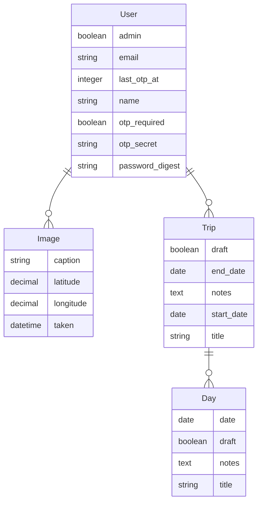

# Trip

A Rails travel blog. Trips are made up of days, days are written in markdown
with embedded images, and visitors can follow along without signing in.

## Data Model

```mermaid
erDiagram
	direction TB
	Day {
		date date
		boolean draft
		text notes
		string title
	}
	Image {
		string caption
		decimal latitude
		decimal longitude
		datetime taken
	}
	Trip {
		boolean draft
		date end_date
		text notes
		date start_date
		string title
	}
	User {
		boolean admin
		string email
		integer last_otp_at
		string name
		boolean otp_required
		string otp_secret
		string password_digest
	}
	User ||--}o Trip : ""
	User ||--}o Image : ""
	Trip ||--}o Day : ""
```
